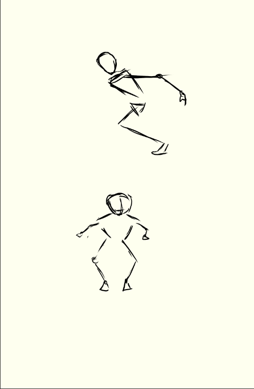

<!-- python Desktop\PhoneGameController\main.py -->

<!-- adb connect 192.168.1.191:42039
cd Desktop\PhoneGameController

npx react-native run-android -->

---

# Install the app

> In motion UDP

```bash
./gradlew clean
./gradlew assembleDebug
adb connect 192.168.1.191:37137
adb install -r app/build/outputs/apk/debug/app-debug.apk
```

# Launch the server
```bash
python server/main.py
```

---

# Features to add
- [ ] Start / Pause program with the phone: walking up to the field of view of the camera triggers motions and inputs, the player isn't ready yet. We should let the player choose when to start / stop.
- [ ] Direction control: 4 buttons on the phone - forwards, backwards, left, right

- [x] Waking / Running: lift knee up to hip level
- [x] Dash forward motion: 


# Bugs
- [x] Jumping doesn't work
- [x] Crouching is inconsistent

